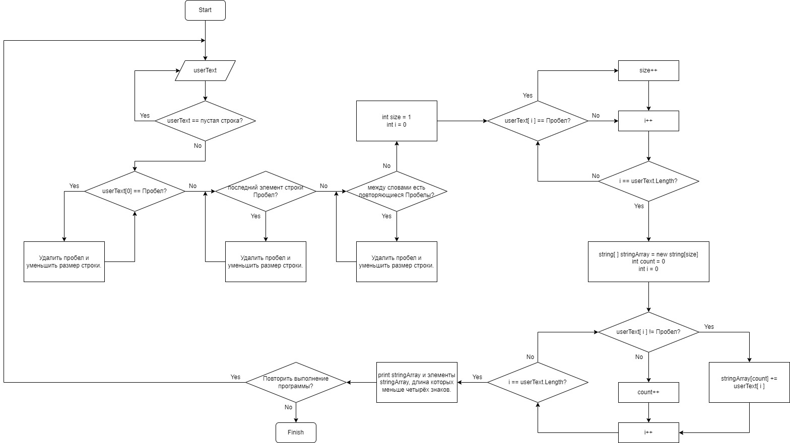

Итоговая проверочная работа.

Данная работа необходима для проверки знаний и навыков по итогу прохождения первого блока обучения на программе разработчик, чтобы убедиться что базовое знакомство с it прошло успешно.

Для выполнения проверочной работы необходимо:
1. Создать репозиторий на GitHub.
2. Нарисовать блок-схему алгоритма.
3. Снабдить репозиторий оформленным текстовым описанием решения (файл README.md).
4. Написать программу, решающую поставленную задачу.
5. Использовать контроль версий в работе над этим небольшим проектом (нельзя заливать всё одним коммитом, как минимум этапы 2, 3 и 4 должны быть расположены в разных коммитах).

Задача:

Написать программу, которая из имеющегося массива строк формирует массив из строк, длина которых меньше либо равна 3 символа. Первоначальный массив можно ввести с клавиатуры, либо задать на старте выполнения алгоритма.
При решении не рекомендуется пользоваться коллекциями, лучше обойтись исключительно массивами.

Примеры:

["hello", "2", "world", ":-)"] -> ["2", ":-)"]
["1234", "1567", "-2", "computer science"] -> ["-2"]
["Russia", "Denmark", "Kazan"] -> []

Решение.

Необходимые действия.
1. Запросить ввод текста от пользователя.
2. Перевести введённый текст в массив.
3. Вывести массив на экран.
4. Вывести на экран элементы массива, подходящие по условиям задачи.

Алгоритм работы программы.

Описание алгоритма программы.
1. Программа запрашивает ввод текста от пользователя.
2. Если пользователь ошибся или намеренно ввёл пустую строку или строку, состоящую из пробелов, то программа выдаёт сообщение: "Строка не должна быть пустой!"
3. Если введённая строка не пустая, то программа начнёт проверять её на наличие лишних пробелов (т.к. в будущем они будут использоваться как определитель разделения слов).
4. Для создания массива программа узнаёт какого размера он будет.
5. Создаёт массив нужного размера и записывает в него значения.
6. После окончания записи значений в массив программа выводит его на экран.
7. Также программа выводит, подходящие под условие задачи, элементы массива.
8. Запрашивается перезапуск программы.